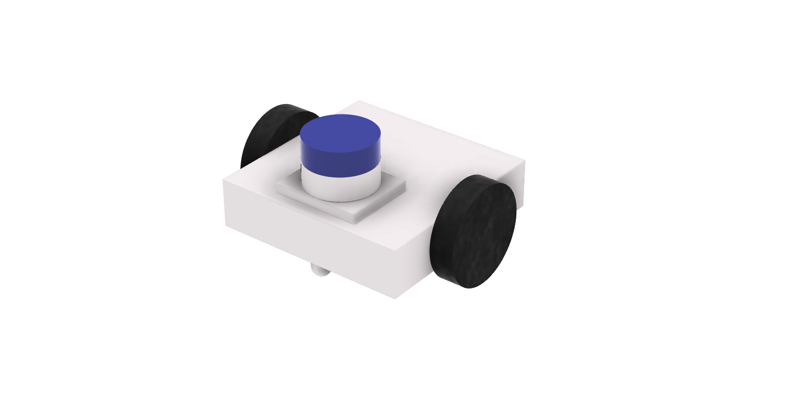
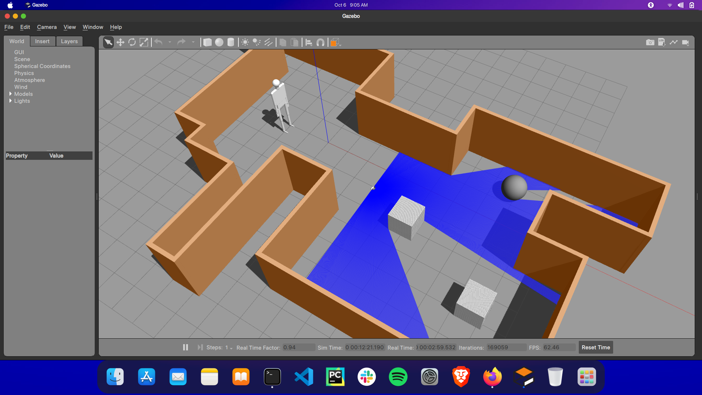
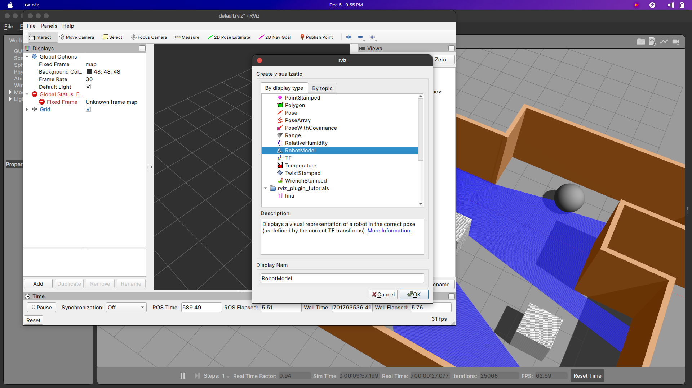
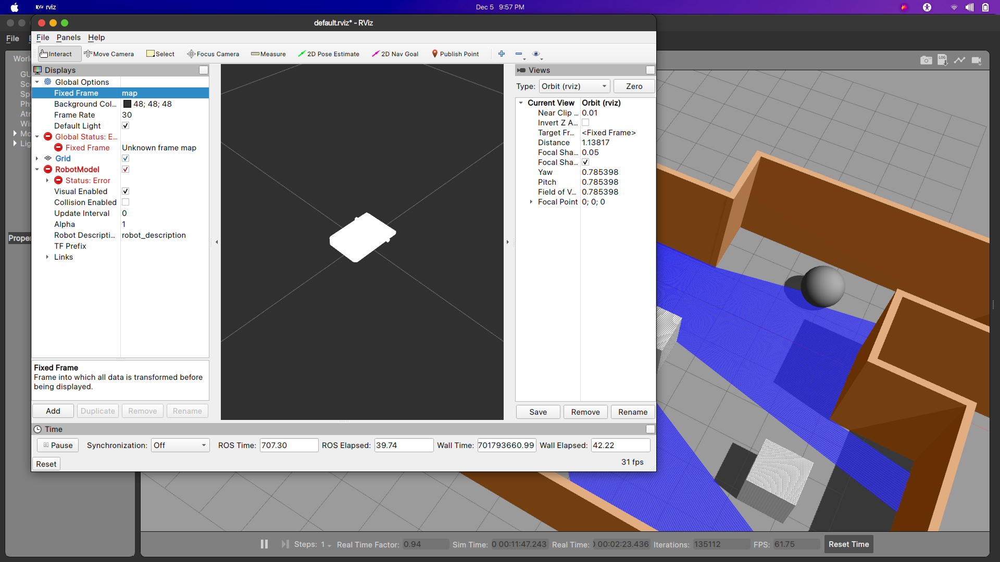
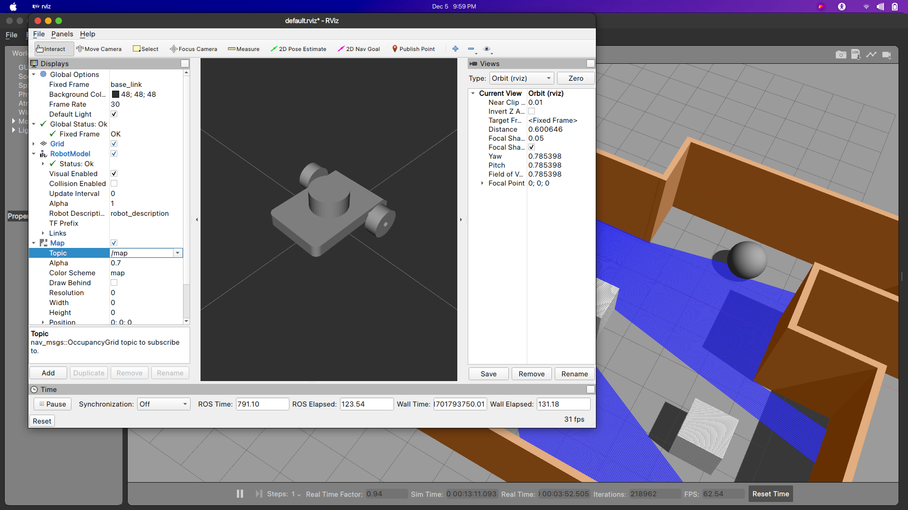

<p align="center">
    
    
</p>

# A Simple Differential Drive Robot

**Robot Motion planning** is a computational problem to find a sequence of valid configurations that moves the robot from the source to the destination. Generally, it includes **Path Searching** and **Trajectory Optimization**.

* **Path Searching**: Based on path constraints, e.g., obstacles, it searches an optimal path sequence for the robot to travel without collisions from the source to the destination.

* **Trajectory Planning**: Based on kinematics, dynamics and obstacles, it optimizes a motion state trajectory from the source to the destination according to the path sequence.

**Your stars, forks and PRs are welcome!**


## Table of Contents
- [Quick Start](#0)
- [Model](#1)
- [Simulation](#2)
- [Control Robot Movement](#3)
- [Papers](#4)
- [Application on a Real Robot](#5)
- [Important Updates](#6)
- [Acknowledgments](#7)
- [License](#8)
- [Maintenance](#9)

## <span id="0">0. Quick Start

*Tested on ubuntu 20.04 LTS with ROS Noetic.*

1. Install [ROS](http://wiki.ros.org/ROS/Installation) (Desktop-Full *suggested*).

2. Install git.

    ```bash
    sudo apt install git
    ```

3. Other dependence.

    ```bash
    sudo apt-get install ros-noetic-joy ros-noetic-teleop-twist-joy ros-noetic-teleop-twist-keyboard ros-noetic-amcl ros-noetic-map-server ros-noetic-move-base ros-noetic-urdf ros-noetic-xacro ros-noetic-rqt-image-view ros-noetic-gmapping ros-noetic-navigation ros-noetic-robot-state-publisher ros-noetic-dwa-local-planner ros-noetic-joint-state-publisher-gui
    ```

4. Clone this reposity.

    ```bash
    cd catkin_ws/src
    git clone https://github.com/aaqibmahamood/A-Simple-Diff-Drive-Robot.git
    ```

5. Compile the code.
   
    ```bash
    cd /catkin_ws
    catkin_make
    # or
    # catkin build
    # you may need to install it by: sudo apt install python-catkin-tools
    ```

    **NOTE: Changing some launch files DOES NOT work, because some of them are re-generated according to the `src/user_config/user_config.yaml` by a python script when you run `main.sh`. Therefore, you should change configurations in `user_config.yaml` instead of launch files.**

## <span id="1">0. Model

Modelled in Fusion 360

**Links and Joints**
1.base_link
2.lidar_1
3.right_wheel_1
4.left_wheel_1
5.caster_1

Both the right wheel and left wheel have been assigned Revolute Joints and lidar_1 has been assigned Rigid Joint with respect to base_link. Exported URDF file from Fusion360 using URDF_Exporter plugin.

## <span id="2">0. Simulation
## Run the Model

**Run ROS Master**
```
roslaunch myrobot_description gazebo.launch
```
**To Load the Robot in Gazebo simulator and rviz use the following commands in separate terminals:**
* **Load Robot in Gazebo**
```
roslaunch myrobot_description gazebo.launch
```
* **Start Rviz for visualisation**
```
rviz
```
* **Pause Simulation in Gazebo**


* **Add Robot Model in Rviz**## <span id="0">0. Quick Start
  - Add and Select Robot Model.
  

  - Set Fixed Frame to base_link
  
  

### Open another terminal to run the following command for mapping using Gmapping package

* **Run Launch file having Gmapping Package**
```
roslaunch myrobot_description mapping.launch
``` 
* **Add Robot Model in Rviz**
  - Add and Select Map.
  

  - Select Topic in Map to /map.
  
  - Add and Select Laserscan.
  

  - Set Topic to /scan.
  

  - Increase the size parameter of the laser scan to 0.05(m)
  

## <span id="3">0. Control Robot Movement

## Keyboard teleop mode:
The ~/catkin_ws/src/myrobot_control/scripts folder contains the *myrobot_key* node, which is the teleop node. There is already a standard teleop node implementation available (for the turtlebot), we simply reused the node. Then a remapping is done from the turtlebot_teleop_keyboard/cmd_vel to /cmd_vel of our robot in the *keyboard_teleop.launch* file.

### To drive around the robot for mapping the world use teleop_twist_keyboard package - Open another terminal and run the following commands

* Start the teleop node:
```
roslaunch teleop_twist_keyboard teleop_twist_keyboard.py
```

* Start RViz to visualize the robot state:
```
rosrun rviz rviz
```
7. Use **2D Nav Goal** to select the goal.

8. Moving!
Here are some keyboard controls for Teleop Twist Keyboard: 
i: Forward
,: Backwards
k: Stop
j: Rotate left in place
l: Rotate right in place

Notice that the teleop node receives keypresses only when the terminal window is active.